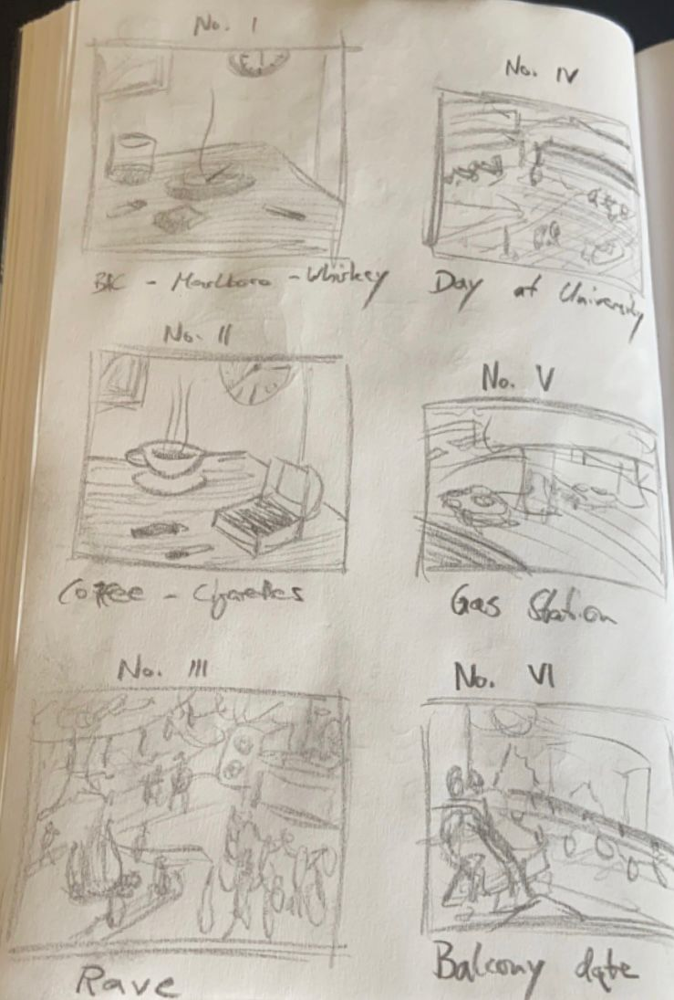

/*
Title: my blog
*/

<html>
    <head>
        <link rel="shortcut icon" type="image/png" href="favicon-16x16.png?"/>
    </head>
</html>

# A blog about my art :)

  
Here i post inspirations, i use for my art.
Although i respect and appreciate the "old masters", I mainly draw inspiration
from the modern art era until now.
I love paintings from the Expressionism, Cubism, Furusim, Dadaism, Surrealism, Minimalism,
some Photorealism (especially Richter's artwork) and last but not least, contemporarism.
Besides my inspirationsources, i will post my own artwork, which will consist mainly
of paintings (acrilc), drawings, sketches and tattoo's. :)

Now have fun reading my Blog!

  
### Inspiration 

Here i list the inspriations i love and use for my own work.
 - Mondrian
 - Van Gogh
 - Monet
 - Rothko

  
### Artwork

Here i will show my own art work, have a look:

<!----->

This is a first sketch of 6 paintings i want to make.

